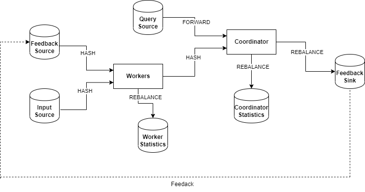

 

## Description

> Integration of the Functional Geometric Monitoring (FGM) method in the Apache Flink platform

Functional Geometric Monitoring is a technique that can be applied to any monitoring problem in order to perform distributed and scalable monitoring with minimal communication cost.The FGM method is a method that is independent of the monitoring problem, to achieve this the method uses a problem-specific family of functions termed safe functions.Finally, the FGM method can be naturally adapted under adverse conditions of the monitoring problem such as very tight monitoring bounds and the presence of skew in the distribution of data among the distributed nodes.

## Project Structure

The project structure was organized as follow:

* Worker
  1. Worker logic
  2. Worker structure
* Coordinator
  1.  Coordinator logic
  2.  Coordinator structure
* State
  1. Coordinator state
  2. Worker State
* Datatypes
  1.  Vector
  2.  Sketches
        1.  Count-Min
        1.  AGMS 
* SafeZone
* Job
  1. JobIteration
  2. JobKafka

## Architecture

The two main components of the architecture are the Workers and the Coordinator. Each of these operators is a 
<a href="https://nightlies.apache.org/flink/flink-docs-master/docs/dev/datastream/operators/process_function/#the-keyedprocessfunction" target="_blank"> KeyedCoProcess</a>
operator. In particular, the Workers operator has two inputs, the first refers to the **Input** source and the second to the **Feedback** source that contains the control messages from the Coordinator. Respectively the Coordinator has two inputs, the first refers to the control messages from the Coordinator, and the second to the user-posed queries(**Query** source). Each of these operators has a 
<a href="https://nightlies.apache.org/flink/flink-docs-master/docs/dev/datastream/side_output/" target="_blank">side-output</a>. 
The side-outputs in this case act as a **logging** mechanism that records metrics/information about the system such as the communication cost, throughput, latency, and back-pressure.
Regarding the implementation of the  feedback loop, there are two approaches.The first implementation uses as feedback loop a **Kafka topic** that acts as buffer between the Workers and the Coordinator.The second implementation uses as feedback loop the build-in operator of 
<a href="https://nightlies.apache.org/flink/flink-docs-master/docs/dev/dataset/iterations/" target="_blank">Iterative stream</a>.

## Configuration
Depending on the monitoring problem all you need to do is configure the Vector and SafeZone class.
